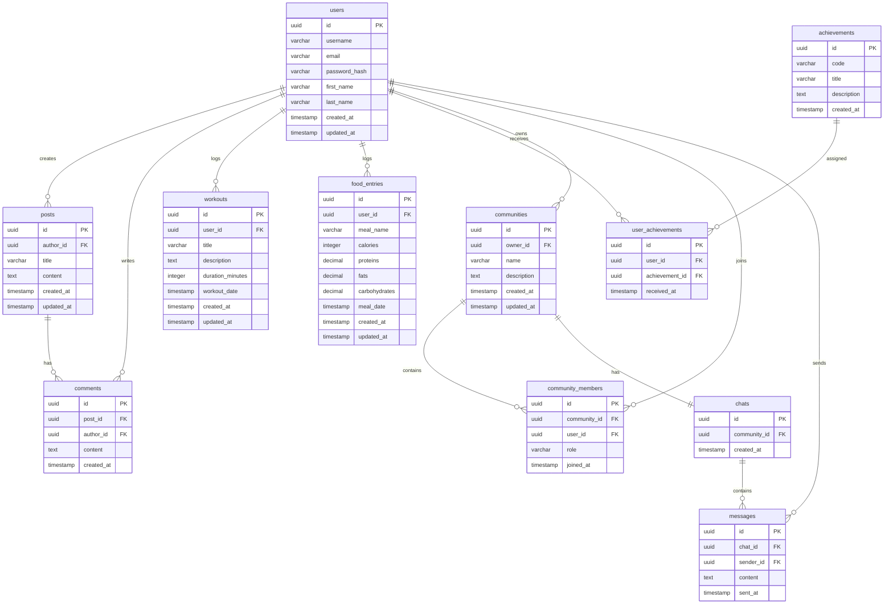

# ER-диаграмма базы данных

## Описание

База данных проекта T-Health хранит информацию о пользователях, постах, комментариях, тренировках, питании, достижениях, сообществах и чатах.

## Основные сущности

-   `users` - пользователи
    
-   `posts` - посты в ленте
    
-   `comments` - комментарии к постам
    
-   `workouts` - тренировки пользователей
    
-   `food_entries` - записи о питании
    
-   `achievements` - справочник достижений
    
-   `user_achievements` - достижения пользователей
    
-   `communities` - сообщества по интересам
    
-   `community_members` - участники сообществ
    
-   `chats` - чаты сообществ
    
-   `messages` - сообщения в чатах
    

## ER-диаграмма

## Связи между таблицами

### users → posts

Один пользователь может создать много постов.

### users → comments

Один пользователь может оставить много комментариев.

### posts → comments

Один пост может иметь много комментариев.

### users → workouts

Один пользователь может добавить много тренировок.

### users → food_entries

Один пользователь может добавить много записей о питании.

### users → user_achievements

Один пользователь может получить много достижений.

### achievements → user_achievements

Одно достижение может быть выдано многим пользователям.

### users → communities

Один пользователь может создать много сообществ.

### communities → community_members

Одно сообщество может иметь много участников.

### users → community_members

Один пользователь может состоять в нескольких сообществах.

### communities → chats

Одно сообщество имеет один чат.

### chats → messages

Один чат содержит много сообщений.

### users → messages

Один пользователь может отправить много сообщений.

## Индексы и ограничения

Для повышения производительности и целостности данных планируется использовать:

-   уникальный индекс на `users.email`;
    
-   уникальный индекс на `users.username`;
    
-   уникальный индекс на `achievements.code`;
    
-   уникальный индекс на пару `user_achievements(user_id, achievement_id)`;
    
-   уникальный индекс на пару `community_members(community_id, user_id)`;
    
-   индексы на внешние ключи:
    
    -   `posts.author_id`;
        
    -   `comments.post_id`;
        
    -   `comments.author_id`;
        
    -   `workouts.user_id`;
        
    -   `food_entries.user_id`;
        
    -   `messages.chat_id`;
        
    -   `messages.sender_id`.
        

## Типы связей

| Связь  | Тип |
| ------------- | ------------- |
| User - Post  | One-to-Many  |
| User - Comment  | One-to-Many  |
| Post - Comment  | One-to-Many  |
| User - Workout  | One-to-Many  |
| User - FoodEntry  | One-to-Many  |
| User - Achievement  | Many-to-Many через `user_achievements`  |
| User - Community  | Many-to-Many через `community_members`  |
| Community - Chat  | One-to-One  |
| Chat - Message  | One-to-Many  |
| User - Message  | One-to-Many  |
