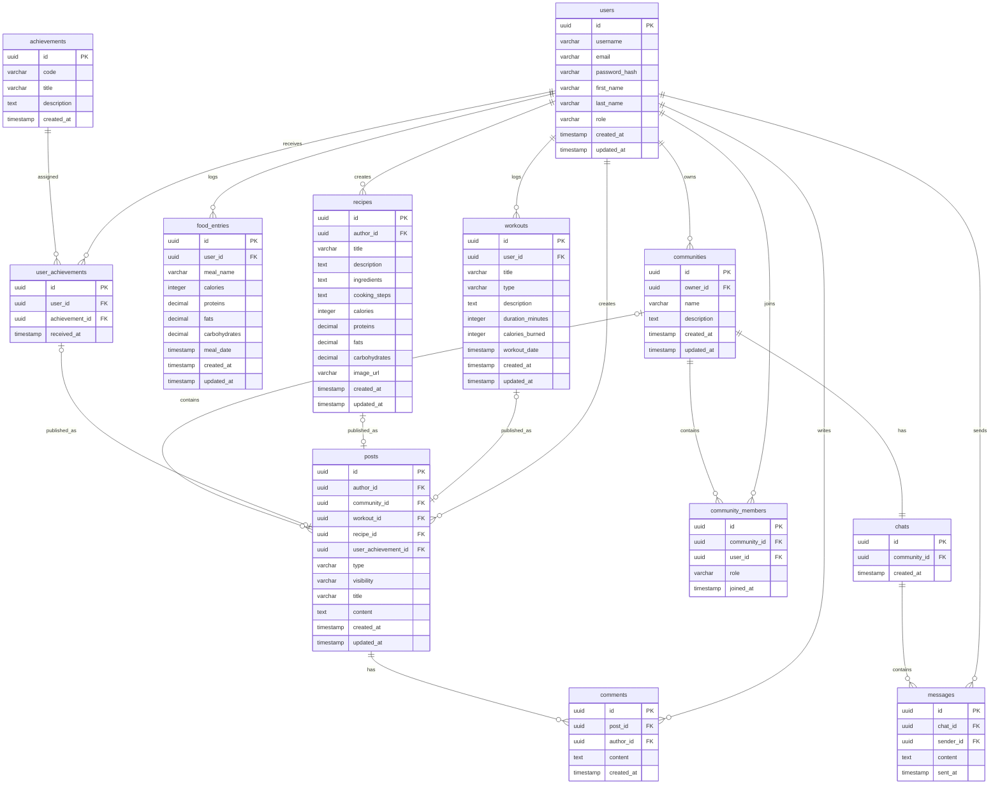

# ER-диаграмма базы данных

## Описание

База данных проекта T-Health хранит информацию о пользователях, постах в ленте активности, комментариях, тренировках, приемах пищи, 
рецептах, достижениях, сообществах и чатах.

В системе разделяются личные записи пользователя и публичные публикации в ленте:

- `food_entries` — личные записи о приёмах пищи пользователя. Они используются для отслеживания КБЖУ и по умолчанию не отображаются в ленте.
- `workouts` — личные записи о тренировках пользователя. Тренировка может оставаться личной или быть опубликована в ленте через пост.
- `recipes` — рецепты пользователя. Рецепт может быть создан для личного использования или опубликован в ленте через пост.
- `posts` — публичные публикации в ленте активности. Пост может быть обычным текстовым постом или ссылаться на тренировку, рецепт или достижение пользователя.

## Основные сущности

-   `users` - пользователи
    
-   `posts` - посты в ленте
    
-   `comments` - комментарии к постам
    
-   `workouts` - тренировки пользователей
    
-   `food_entries` - личные записи о приемах пищи

-   `recipes` - рецепты пользователей
    
-   `achievements` - справочник достижений
    
-   `user_achievements` - достижения пользователей
    
-   `communities` - сообщества по интересам
    
-   `community_members` - участники сообществ
    
-   `chats` - чаты сообществ
    
-   `messages` - сообщения в чатах
    

## ER-диаграмма

## Логика личных записей и публикаций

### Приёмы пищи

Приём пищи является личной записью пользователя и хранится в таблице `food_entries`.

Пользователь может добавить приём пищи для отслеживания дневного прогресса по КБЖУ. Такая запись видна только самому пользователю и не отображается в ленте активности.

Создание записи в `food_entries` не создаёт пост в `posts`.

### Рецепты

Рецепт хранится в таблице `recipes`.

Пользователь может создать рецепт только для себя. В этом случае создаётся запись в `recipes`, но пост в ленте не создаётся.

Если пользователь хочет поделиться рецептом, создаётся запись в `posts` с `type = RECIPE`, которая ссылается на рецепт через `recipe_id`.

### Тренировки

Тренировка хранится в таблице `workouts`.

Пользователь может создать тренировку только для себя. В этом случае создаётся запись в `workouts`, но пост в ленте не создаётся.

Если пользователь хочет поделиться тренировкой, создаётся запись в `posts` с `type = WORKOUT`, которая ссылается на тренировку через `workout_id`.

Если пользователь сразу создаёт тренировку как пост, система сначала создаёт запись в `workouts`, а затем создаёт запись в `posts` с ссылкой на эту тренировку.

### Посты

Пост является публичной публикацией в ленте активности.

Поле `type` определяет тип поста:

* `TEXT` - обычный текстовый пост;
* `WORKOUT` - пост с тренировкой;
* `RECIPE` - пост с рецептом;
* `ACHIEVEMENT` - пост с достижением.

Поле `visibility` определяет видимость поста:

* `PUBLIC` - пост доступен всем пользователям;
* `COMMUNITY` - пост доступен участникам конкретного сообщества.

Если `visibility = COMMUNITY`, поле `community_id` должно быть заполнено.

Если `visibility = PUBLIC`, поле `community_id` должно быть пустым.

Если `type = WORKOUT`, должно быть заполнено поле `workout_id`.

Если `type = RECIPE`, должно быть заполнено поле `recipe_id`.

Если `type = ACHIEVEMENT`, должно быть заполнено поле `user_achievement_id`.

Если `type = TEXT`, поля `workout_id`, `recipe_id` и `user_achievement_id` должны быть пустыми.

## Связи между таблицами

### users → posts

Один пользователь может создать много постов.

### users → comments

Один пользователь может оставить много комментариев.

### posts → comments

Один пост может иметь много комментариев.

### users → workouts

Один пользователь может добавить много тренировок.

### workouts → posts

Одна тренировка может быть опубликована как пост в ленте активности.

### users → food_entries

Один пользователь может добавить много личных записей о приемах пищи.

### users → recipes

Один пользователь может создать много рецептов.

### recipes → posts

Один рецепт может быть опубликован как пост в ленте активности.

### users → user_achievements

Один пользователь может получить много достижений.

### achievements → user_achievements

Одно достижение может быть выдано многим пользователям.

### user_achievements → posts

Полученное пользователем достижение может быть опубликовано как пост в ленте активности.

### users → communities

Один пользователь может создать много сообществ.

### communities → posts

Одно сообщество может содержать много постов.

### communities → community_members

Одно сообщество может иметь много участников.

### users → community_members

Один пользователь может состоять в нескольких сообществах.

### communities → chats

Одно сообщество имеет один чат.

### chats → messages

Один чат содержит много сообщений.

### users → messages

Один пользователь может отправить много сообщений.

## Индексы и ограничения

Для повышения производительности и целостности данных планируется использовать:

-   уникальный индекс на `users.email`;
    
-   уникальный индекс на `users.username`;
    
-   уникальный индекс на `achievements.code`;
    
-   уникальный индекс на пару `user_achievements(user_id, achievement_id)`;
    
-   уникальный индекс на пару `community_members(community_id, user_id)`;

-   уникальный индекс на `chats.community_id`, чтобы у одного сообщества был только один чат;
  
-   уникальный индекс на `posts.workout_id`, где `workout_id` IS NOT NULL; 

-   уникальный индекс на `posts.recipe_id`, где `recipe_id` IS NOT NULL;
  
-   уникальный индекс на `posts.user_achievement_id`, где `user_achievement_id` IS NOT NULL.

-   индекс на `posts.created_at` для ускорения сортировки ленты активности;

-   индекс на `messages.sent_at` для сортировки истории сообщений;

-   индекс на `comments.created_at` для сортировки комментариев.
    
-   индексы на внешние ключи:
    
    -   `posts.author_id`;
    
    -   `posts.community_id`;
    
    -   `posts.workout_id`;

    -   `posts.recipe_id`;
    
    -   `posts.user_achievement_id`;
        
    -   `comments.post_id`;
        
    -   `comments.author_id`;
        
    -   `workouts.user_id`;
        
    -   `food_entries.user_id`;

    -   `recipes.author_id`;
    
    -   `user_achievements.user_id`;
    
    -   `user_achievements.achievement_id`;
    
    -   `communities.owner_id`;
    
    -   `community_members.community_id`;
    
    -   `community_members.user_id`;
    
    -   `chats.community_id`;
        
    -   `messages.chat_id`;
        
    -   `messages.sender_id`.

## Типы связей

| Связь                      | Тип                                    |
| -------------------------- | -------------------------------------- |
| User - Post                | One-to-Many                            |
| User - Comment             | One-to-Many                            |
| Post - Comment             | One-to-Many                            |
| User - Workout             | One-to-Many                            |
| Workout - Post             | One-to-Zero-or-One                     |
| User - FoodEntry           | One-to-Many                            |
| User - Recipe              | One-to-Many                            |
| Recipe - Post              | One-to-Zero-or-One                     |
| User - Achievement         | Many-to-Many через `user_achievements` |
| UserAchievement - Post     | One-to-Zero-or-One                     |
| User - Community as owner  | One-to-Many                            |
| User - Community as member | Many-to-Many через `community_members` |
| Community - Post           | One-to-Many                            |
| Community - Chat           | One-to-One                             |
| Chat - Message             | One-to-Many                            |
| User - Message             | One-to-Many                            |
