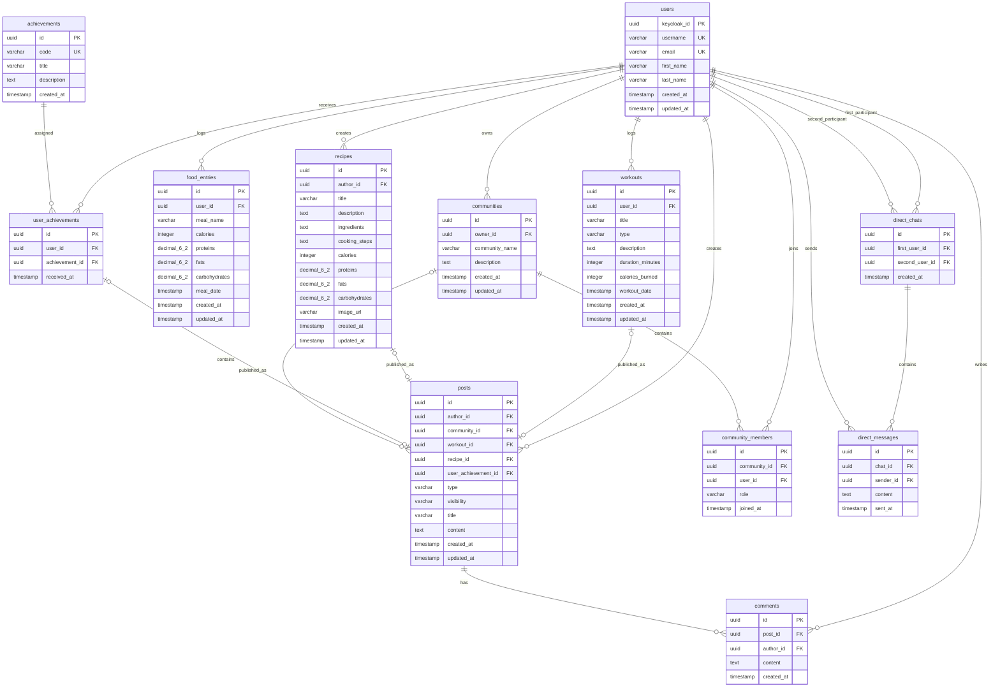

# ER-диаграмма базы данных

## Описание

База данных проекта T-Health хранит информацию о пользователях, постах в ленте активности, комментариях, тренировках, приемах пищи,
рецептах, достижениях, сообществах и личных чатах.

В системе разделяются личные записи пользователя и публичные публикации в ленте:

- `food_entries` — личные записи о приёмах пищи пользователя. Они используются для отслеживания КБЖУ и по умолчанию не отображаются в ленте.
- `workouts` — личные записи о тренировках пользователя. Тренировка может оставаться личной или быть опубликована в ленте через пост.
- `recipes` — рецепты пользователя. Рецепт может быть создан для личного использования или опубликован в ленте через пост.
- `posts` — публикации в ленте активности. Пост может быть обычным текстовым постом или ссылаться на тренировку, рецепт или достижение пользователя. Посты могут быть публичными или относиться к конкретному сообществу.
- `direct_chats` и `direct_messages` — личные чаты 1 на 1 и сообщения внутри них.

Аутентификация пользователей выполняется через Keycloak. В локальной таблице `users` хранится идентификатор пользователя из Keycloak и информация профиля. Пароли и роли пользователей в локальной базе данных не хранятся.

## Основные сущности

-   `users` - пользователи
    
-   `posts` - посты в ленте
    
-   `comments` - комментарии к постам
    
-   `workouts` - тренировки пользователей
    
-   `food_entries` - личные записи о приемах пищи

-   `recipes` - рецепты пользователей
    
-   `achievements` - справочник достижений
    
-   `user_achievements` - достижения пользователей
    
-   `communities` - сообщества по интересам
    
-   `community_members` - участники сообществ

-   `direct_chats` — личные чаты 1 на 1

-   `direct_messages` — сообщения в личных чатах
    

## ER-диаграмма

## Логика личных записей и публикаций

### Приёмы пищи

Приём пищи является личной записью пользователя и хранится в таблице `food_entries`.

Пользователь может добавить приём пищи для отслеживания дневного прогресса по КБЖУ. Такая запись видна только самому пользователю и не отображается в ленте активности.

Создание записи в `food_entries` не создаёт пост в `posts`.

### Рецепты

Рецепт хранится в таблице `recipes`.

Пользователь может создать рецепт только для себя. В этом случае создаётся запись в `recipes`, но пост в ленте не создаётся.

Если пользователь хочет поделиться рецептом, создаётся запись в `posts` с `type = RECIPE`, которая ссылается на рецепт через `recipe_id`.

### Тренировки

Тренировка хранится в таблице `workouts`.

Пользователь может создать тренировку только для себя. В этом случае создаётся запись в `workouts`, но пост в ленте не создаётся.

Если пользователь хочет поделиться тренировкой, создаётся запись в `posts` с `type = WORKOUT`, которая ссылается на тренировку через `workout_id`.

Если пользователь сразу создаёт тренировку как пост, система сначала создаёт запись в `workouts`, а затем создаёт запись в `posts` с ссылкой на эту тренировку.

### Посты

Пост является публикацией в ленте активности.

Поле `type` определяет тип поста:

* `TEXT` - обычный текстовый пост;
* `WORKOUT` - пост с тренировкой;
* `RECIPE` - пост с рецептом;
* `ACHIEVEMENT` - пост с достижением.

Поле `visibility` определяет видимость поста:

* `PUBLIC` - пост доступен всем пользователям;
* `COMMUNITY` - пост относится к конкретному сообществу и доступен в его ленте.

Если `visibility = COMMUNITY`, поле `community_id` должно быть заполнено.

Если `visibility = PUBLIC`, поле `community_id` должно быть пустым.

Если `type = WORKOUT`, должно быть заполнено поле `workout_id`.

Если `type = RECIPE`, должно быть заполнено поле `recipe_id`.

Если `type = ACHIEVEMENT`, должно быть заполнено поле `user_achievement_id`.

Если `type = TEXT`, поля `workout_id`, `recipe_id` и `user_achievement_id` должны быть пустыми.

Одна тренировка, один рецепт или одно полученное достижение могут быть опубликованы в ленте не более одного раза.

### Личные чаты

Личный чат хранится в таблице `direct_chats` и связывает двух различных пользователей.

Для одной неупорядоченной пары пользователей может существовать только один личный чат. Это означает, что пары «пользователь A — пользователь B» и «пользователь B — пользователь A» считаются одним и тем же чатом.

Сообщения личного чата хранятся в таблице `direct_messages` и связаны с чатом через поле `chat_id`.

Отправлять сообщения и просматривать историю личного чата могут только его участники.

## Связи между таблицами

### users → posts

Один пользователь может создать много постов.

### users → comments

Один пользователь может оставить много комментариев.

### posts → comments

Один пост может иметь много комментариев.

### users → workouts

Один пользователь может добавить много тренировок.

### workouts → posts

Одна тренировка может быть опубликована как пост в ленте активности не более одного раза.

### users → food_entries

Один пользователь может добавить много личных записей о приемах пищи.

### users → recipes

Один пользователь может создать много рецептов.

### recipes → posts

Один рецепт может быть опубликован как пост в ленте активности не более одного раза.

### users → user_achievements

Один пользователь может получить много достижений.

### achievements → user_achievements

Одно достижение может быть выдано многим пользователям.

### user_achievements → posts

Полученное пользователем достижение может быть опубликовано как пост в ленте активности не более одного раза.

### users → communities

Один пользователь может создать много сообществ.

### communities → posts

Одно сообщество может содержать много постов.

### communities → community_members

Одно сообщество может иметь много участников.

### users → community_members

Один пользователь может состоять в нескольких сообществах.

### users → direct_chats

Один пользователь может участвовать во многих личных чатах как первый или второй участник.

### direct_chats → direct_messages

Один личный чат может содержать много сообщений.

### users → direct_messages

Один пользователь может отправить много личных сообщений.

## Индексы и ограничения

Для повышения производительности и обеспечения целостности данных используются:

-   уникальный индекс на `users.email`;
    
-   уникальный индекс на `users.username`;
    
-   уникальный индекс на `achievements.code`;
    
-   уникальный индекс на пару `user_achievements(user_id, achievement_id)`;
    
-   уникальный индекс на пару `community_members(community_id, user_id)`;

-   уникальный индекс на неупорядоченную пару участников личного чата `direct_chats(first_user_id, second_user_id)`;
  
-   уникальный индекс на `posts.workout_id`, где `workout_id` IS NOT NULL; 

-   уникальный индекс на `posts.recipe_id`, где `recipe_id` IS NOT NULL;
  
-   уникальный индекс на `posts.user_achievement_id`, где `user_achievement_id` IS NOT NULL;

-   индекс на `posts.created_at DESC` для ускорения сортировки ленты активности;

-   составной индекс на `comments(post_id, created_at DESC)` для получения комментариев поста;

-   составной индекс на `direct_messages(chat_id, sent_at DESC)` для сортировки истории личных сообщений;

-   индексы на внешние ключи:
    
    -   `posts.author_id`;
    
    -   `posts.community_id`;
    
    -   `comments.author_id`;
        
    -   `workouts.user_id`;
        
    -   `food_entries.user_id`;

    -   `recipes.author_id`;
    
    -   `user_achievements.user_id`;
    
    -   `user_achievements.achievement_id`;
    
    -   `communities.owner_id`;
    
    -   `community_members.community_id`;
    
    -   `community_members.user_id`;

    -   `direct_messages.sender_id`.

Также используются следующие проверочные ограничения:

-   продолжительность тренировки должна быть больше нуля;

-   количество сожжённых калорий тренировки не может быть отрицательным;

-   калории, белки, жиры и углеводы записи питания не могут быть отрицательными;

-   калории, белки, жиры и углеводы рецепта не могут быть отрицательными, если они заполнены;

-   роль участника сообщества может иметь значение `OWNER`, `MODERATOR` или `MEMBER`;

-   тип поста может иметь значение `TEXT`, `WORKOUT`, `RECIPE` или `ACHIEVEMENT`;

-   видимость поста может иметь значение `PUBLIC` или `COMMUNITY`;

-   участниками личного чата должны быть два разных пользователя.

Дополнительная согласованность типа поста, его видимости и связанных сущностей контролируется бизнес-логикой приложения.

## Типы связей

| Связь                                  | Тип                                    |
| -------------------------------------- | -------------------------------------- |
| User - Post                            | One-to-Many                            |
| User - Comment                         | One-to-Many                            |
| Post - Comment                         | One-to-Many                            |
| User - Workout                         | One-to-Many                            |
| Workout - Post                         | One-to-Zero-or-One                     |
| User - FoodEntry                       | One-to-Many                            |
| User - Recipe                          | One-to-Many                            |
| Recipe - Post                          | One-to-Zero-or-One                     |
| User - Achievement                     | Many-to-Many через `user_achievements` |
| UserAchievement - Post                 | One-to-Zero-or-One                     |
| User - Community as owner              | One-to-Many                            |
| User - Community as member             | Many-to-Many через `community_members` |
| Community - Post                       | One-to-Many                            |
| User - DirectChat as first participant | One-to-Many                            |
| User - DirectChat as second participant| One-to-Many                            |
| DirectChat - DirectMessage             | One-to-Many                            |
| User - DirectMessage                   | One-to-Many                            |
